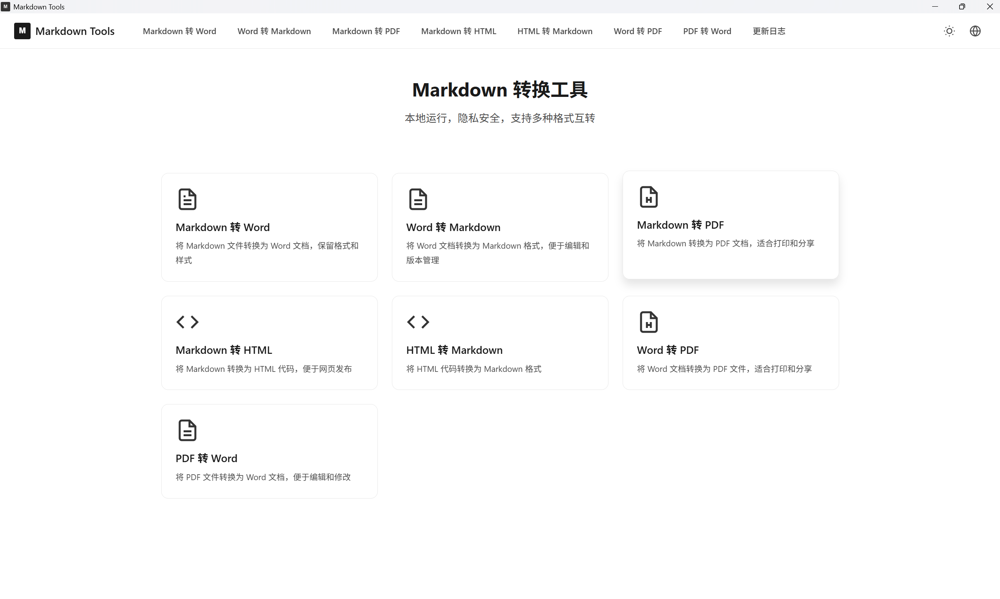

# Markdown Tools

<p align="center">
  
</p>

<p align="center">
  <strong>Un convertisseur de documents moderne et respectueux de la vie privée</strong>
</p>

<p align="center">
  <a href="../README.md">简体中文</a> | 
  <a href="README.en.md">English</a> | 
  <a href="README.ja.md">日本語</a> | 
  <a href="README.fr.md">Français</a> | 
  <a href="README.es.md">Español</a> | 
  <a href="README.de.md">Deutsch</a> | 
  <a href="README.ru.md">Русский</a>
</p>

---

Une application web moderne et respectueuse de la vie privée pour convertir entre les formats Markdown, Word, HTML et PDF. Toutes les conversions se font localement dans votre navigateur - aucune donnée n'est envoyée à un serveur.

## ✨ Fonctionnalités

- **Markdown vers Word** - Convertir les fichiers Markdown en documents Word (.docx) en préservant le formatage
- **Word vers Markdown** - Convertir les documents Word au format Markdown pour une édition facile
- **Markdown vers PDF** - Convertir Markdown en documents PDF, adapté à l'impression et au partage
- **Markdown vers HTML** - Convertir Markdown en code HTML pour la publication web
- **HTML vers Markdown** - Convertir le code HTML au format Markdown
- **Word vers PDF** - Convertir les documents Word en fichiers PDF
- **PDF vers Word** - Convertir les fichiers PDF en documents Word

## 🌟 Points Forts

- 🔒 **Confidentialité d'Abord** - Toutes les conversions se font localement dans votre navigateur, aucune donnée n'est envoyée à un serveur
- 🖥️ **Support Application de Bureau** - Peut être empaqueté comme application de bureau Windows/macOS/Linux
- 🌍 **Support Multilingue** - Prend en charge 7 langues : chinois, anglais, japonais, français, espagnol, allemand et russe
- 🎨 **Interface Moderne** - Design glassmorphisme épuré avec support thème clair/sombre
- 📱 **Design Réactif** - Fonctionne sur les appareils de bureau et mobiles
- ⚡ **Rapide et Efficace** - Construit avec Vite, Web Worker pour le traitement en arrière-plan des gros fichiers
- 📝 **Support LaTeX** - Markdown vers Word/PDF/HTML prend en charge le rendu des formules mathématiques
- 📊 **Indicateur de Progression** - Affiche une barre de progression lors du traitement de gros fichiers

## 🛠️ Stack Technique

- **Vite** - Outil de build frontend de nouvelle génération
- **TypeScript** - JavaScript type-safe
- **Tauri** - Framework d'application de bureau multiplateforme
- **marked** - Analyseur Markdown
- **marked-katex-extension** - Support des formules mathématiques LaTeX
- **docx** - Générateur de documents Word
- **mammoth** - Analyseur de documents Word
- **turndown** - Convertisseur HTML vers Markdown
- **jspdf** + **html2canvas** - Génération PDF
- **pdfjs-dist** - Analyse PDF

## 🚀 Démarrage Rapide

### Prérequis

- Node.js 18+
- npm ou yarn
- Rust (requis pour la build d'application de bureau uniquement)

### Installation

```bash
# Cloner le dépôt
git clone https://github.com/NotFoundRyan/markdown-tools.git

# Entrer dans le répertoire du projet
cd markdown-tools

# Installer les dépendances
npm install
```

### Développement

```bash
# Démarrer le serveur de développement (version Web)
npm run dev

# Démarrer le serveur de développement (application de bureau)
npm run tauri:dev
```

L'application fonctionnera sur `http://localhost:3000`

### Build de Production

```bash
# Build version web
npm run build

# Build application de bureau
npm run tauri:build
```

## 📁 Structure du Projet

```
markdown-tools/
├── public/
│   └── favicon.svg
├── scripts/
│   └── start-dev.ps1       # Script de démarrage développement Windows
├── src/
│   ├── main.ts              # Point d'entrée de l'application
│   ├── scripts/
│   │   ├── pages/           # Composants de page
│   │   ├── utils/           # Fonctions utilitaires
│   │   ├── workers/         # Web Workers
│   │   └── router.ts        # Routage côté client
│   └── styles/
│       ├── components/      # Styles de composants
│       └── pages/           # Styles de pages
├── src-tauri/               # Configuration application de bureau Tauri
│   ├── src/
│   │   └── main.rs
│   ├── Cargo.toml
│   ├── tauri.conf.json
│   └── capabilities/
├── docs/                    # Documentation
│   ├── README.en.md
│   ├── README.ja.md
│   └── images/
├── index.html
├── package.json
├── tsconfig.json
└── vite.config.ts
```

## 📖 Détails des Fonctionnalités

### Internationalisation (i18n)

L'application prend en charge 7 langues :
- 🇨🇳 中文
- 🇺🇸 English
- 🇯🇵 日本語
- 🇫🇷 Français
- 🇪🇸 Español
- 🇩🇪 Deutsch
- 🇷🇺 Русский

La sélection de langue est automatiquement détectée à partir des paramètres du navigateur et sauvegardée dans localStorage.

### Support de Thème

- Mode clair
- Mode sombre
- Suivre le système (bascule automatiquement selon les paramètres de l'OS)

### Formats de Fichier Supportés

| Entrée | Sortie |
|--------|--------|
| `.md`, `.markdown`, `.txt` | `.docx`, `.pdf`, `.html` |
| `.docx` | `.md`, `.pdf` |
| `.html`, `.htm` | `.md` |
| `.pdf` | `.docx` |

### Limite de Taille de Fichier

- Tous les types de fichiers : Maximum **100MB**

### Traitement des Gros Fichiers

- Utilise **Web Worker** pour le traitement en thread d'arrière-plan pour éviter de bloquer l'UI
- Affiche une barre de progression avec retour en temps réel
- Prend en charge le traitement par morceaux pour les très gros fichiers

### Formules Mathématiques LaTeX

Prend en charge les formules en ligne et en bloc :

```markdown
Formule en ligne : $E = mc^2$

Formule en bloc :
$$
\int_{-\infty}^{\infty} e^{-x^2} dx = \sqrt{\pi}
$$
```

### Fonctionnalités Application de Bureau

- Mode instance unique - Empêche les conflits de ressources de plusieurs instances
- Boîte de dialogue de sauvegarde de fichier native - Choisir l'emplacement de sauvegarde
- Utilisation hors ligne - Aucune connexion réseau requise

## 🌐 Support des Navigateurs

- Chrome 90+
- Firefox 90+
- Safari 14+
- Edge 90+

## 🤝 Contribuer

Les contributions sont les bienvenues ! N'hésitez pas à soumettre une Pull Request.

1. Fork ce dépôt
2. Créez votre branche de fonctionnalité (`git checkout -b feature/AmazingFeature`)
3. Committez vos changements (`git commit -m 'Add some AmazingFeature'`)
4. Poussez vers la branche (`git push origin feature/AmazingFeature`)
5. Ouvrez une Pull Request

## 📄 Licence

Ce projet est sous licence MIT - voir le fichier [LICENSE](../LICENSE) pour plus de détails.

## 🙏 Remerciements

- [marked](https://github.com/markedjs/marked) - Analyseur Markdown
- [marked-katex-extension](https://github.com/UziTech/marked-katex-extension) - Extension formules mathématiques LaTeX
- [KaTeX](https://github.com/KaTeX/KaTeX) - Moteur de rendu LaTeX
- [docx](https://github.com/dolanmiu/docx) - Générateur de documents Word
- [mammoth](https://github.com/mwilliamson/mammoth.js) - Analyseur de documents Word
- [turndown](https://github.com/mixmark-io/turndown) - Convertisseur HTML vers Markdown
- [jspdf](https://github.com/parallax/jsPDF) - Génération PDF
- [html2canvas](https://github.com/niklasvh/html2canvas) - Rendu HTML vers canvas
- [pdf.js](https://github.com/nicholasday/pdf.js) - Analyse PDF
- [Tauri](https://tauri.app/) - Framework d'application de bureau multiplateforme

---

Made by Ryan © 2026
